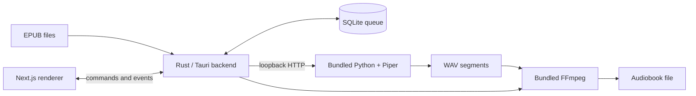

# Audiobook Generator

Audiobook Generator is a Tauri desktop app that converts EPUB files into
audiobooks on the user's computer. Book text is never sent to a remote service.

## Architecture

The static Next.js renderer talks to a Rust backend through Tauri commands and
events. Rust handles EPUB extraction, text chunking, queue state, SQLite,
files, and audio assembly.

For speech, the backend starts one bundled Piper HTTP server on a random
loopback port and reuses it for the active voice. Piper returns WAV segments;
FFmpeg joins and encodes them into the final audiobook.

## Bundled Dependencies

Release packages include all conversion dependencies:

- the compiled Rust/Tauri backend, including SQLite
- the static Next.js/React renderer; no Node.js runtime is shipped
- embedded Python with `piper-tts[http]==1.4.2`
- four Spanish Piper voice models
- FFmpeg and ffprobe

Users do not need to install Python, Piper, voice models, SQLite, or FFmpeg.
Voice model sources and licenses are listed in
[`runtime/licenses/VOICE_MODELS.md`](runtime/licenses/VOICE_MODELS.md).
